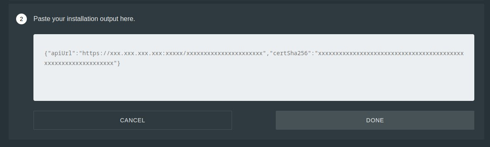

> 
>
> fly to dreams, do not believe the chain on your feet.

---


### prerequests

> set sub.domain for both domestic and forigen servers; if anything happen to your server(may get blocked)
> you can simply replace servers and users will still connected.

---


### install outline server

.I Download the [outline manager](https://github.com/Jigsaw-Code/outline-server/releases) on your desktop.

.II Run this command on the forigen server to install and config outline server

```bash
sudo bash -c "$(wget -qO- https://raw.githubusercontent.com/Jigsaw-Code/outline-server/master/src/server_manager/install_scripts/install_server.sh)"
```

.III Run the *outline manager* and copy and paste the result to the **box** of the *outline manager*.




.IV set 443 or 80 port as the listen port for the forigen server

.V set the sub domain which domestic server ip is behind it.


---


### bridge a domestic server to the forigen server

.I install docker and docker-compose on domestic server.

```bash
sudo curl https://get.docker.com/ | sh
sudo apt-get install docker-compose -y
```

> note that if you encounter **403** *forbidan* error during installation, use [shecan](https://shecan.ir/).

.II clone birdge repo on domestic server.

```bash
git clone https://github.com/shabane/outline-bridge-server
```

.III config the bridge with your server details

```bash
cd outline-bridge-server && setup.py
```


.IV run bridge server

```bash
docker-compose up -d
```

---


### install outline wrapper

to manage outline users with web pannel you can use this web app.

- key features of outline wrapper:
    - avilable on the web with mobile and desktop(no installation needed).
    - create pastebin link for each keys.
    - post each key detail to telegram channel or group.
    - make QR code of each key.
    - multiple servers support.

I. to install it, just copy and paste install command

```bash
sudo apt-get update && sudo apt-get install curl -y && sudo curl https://raw.githubusercontent.com/shabane/echo/master/install.sh | sh
```

II. outline wrapper is avilable wtih your domain or ip, just open web browser and type in your host.

---


### using outline wrapper

I. add a telegram channel or group

to add new channel, you can either channel @username or channel -id which can find with [this bot](https://t.me/username_to_id_bot)


II. add your server detail to servers list


1. ApiUrl is provide on the installing of the outline server.
2. wrapper ip is domestic ip or domain.
3. wrapper port is domestic port.
4. channel is the telegram channel or group.

III. create new user


---


### outline back up

make sure to back up your server data

I. clone and run *outline-auto-backup*

```bash
git clone https://github.com/offline-pirate/outline-auto-backup.git --depth 1 && ./outline-auto-backup/main.sh
```

---

### donate

i hope you enjoy thease stuff, if it is, please consider **any donation** *=)*

[donate me](https://daramet.com/shabane)

<!-- this text is hidden in the result page, i hope someone donate me -->
